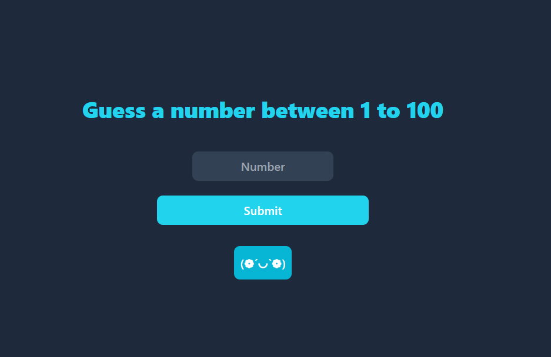

# Number Guessing Game



This is a simple number guessing game built with HTML, Tailwind CSS, and JavaScript. The game allows the user to guess a number between 1 and 100. The computer will check if the user's guess is correct. If the guess is correct, the user wins, and the game restarts. If the guess is incorrect, the computer will provide a hint on whether the guessed number is too close or far from the expected number. The user has 10 chances to guess the number.

## Features

- User can enter a number between 1 and 100.
- Computer checks if the guessed number is correct.
- If the guess is correct, the user wins, and the game restarts.
- If the guess is incorrect, the computer provides a hint on whether the guessed number is too close or far from the expected number.
- User has 10 chances to guess the number.

## Technologies Used

- HTML
- Tailwind CSS
- JavaScript

## How to Play

1. Open the game in your browser.
2. Enter a number between 1 and 100 in the input field.
3. Click the "Guess" button.
4. The computer will check your guess and provide feedback:
   - If your guess is correct, you win, and the game restarts.
   - If your guess is incorrect, the computer will tell you if your guess is too close or far from the expected number.
5. You have 10 chances to guess the number.

## Installation

To run the game locally, follow these steps:

1. Clone the repository:
    ```bash
    git clone https://github.com/your-username/guess-game.git
    ```
2. Navigate to the project directory:
    ```bash
    cd guess-game
    ```
3. Open `index.html` in your browser.

## Usage

- Enter your guess in the input field.
- Click the "Guess" button to submit your guess.
- Follow the feedback provided by the computer to guess the correct number within 10 chances.

## Contributing

If you would like to contribute to the project, please follow these steps:

1. Fork the repository.
2. Create a new branch:
    ```bash
    git checkout -b feature-branch
    ```
3. Make your changes and commit them:
    ```bash
    git commit -m 'Add some feature'
    ```
4. Push to the branch:
    ```bash
    git push origin feature-branch
    ```
5. Open a pull request.

## License

This project is licensed under the MIT License - see the [LICENSE](LICENSE) file for details.

## Contact

If you have any questions or feedback, please feel free to reach out to me at [prantopaul55555@gmail.com](mailto:your-email@example.com).

---

Happy guessing!
